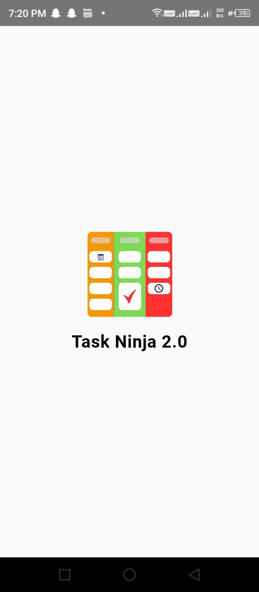
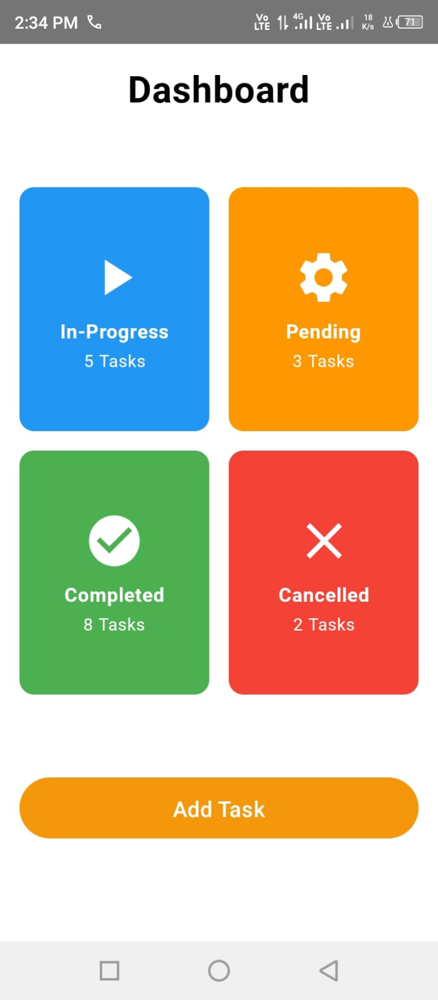
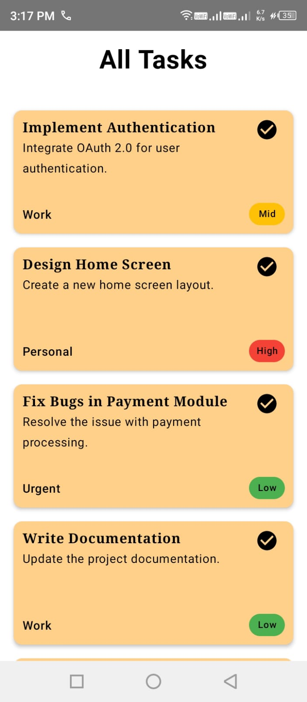
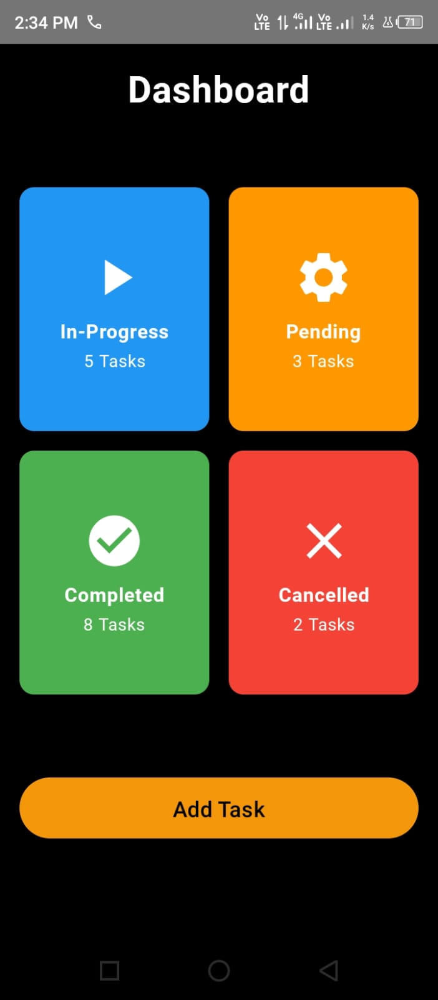
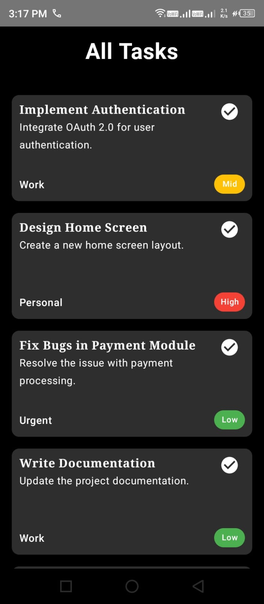
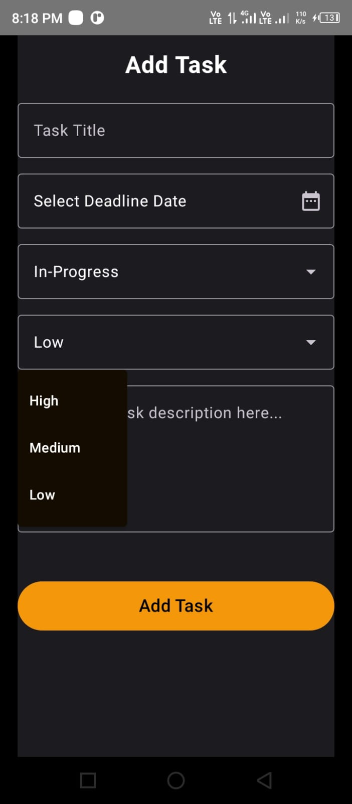

# Task Ninja 2.0

Task Ninja 2.0 is an app that allows you to manage tasks efficiently.

## Features
- Add tasks based on priority and progress status
- Update tasks
- Delete tasks
- See a vertical list of tasks with a proper Kanban dashboard

### Planned Features
- **Create Project and Add Tasks**: Allow users to create projects and organize tasks within each project.
- **Export List**: Provide options to export task lists as PDF or text files for easy sharing and documentation.
- **Advanced Filters**: Implement filters to sort tasks by priority and deadline date, enhancing task management.
- **Task Reminders**: Introduce reminders to notify users of upcoming task deadlines to ensure timely completion.

## Contributing

This project is open to contributions from the community. Whether it's fixing a bug, adding a new feature, or improving documentation, your contributions are welcome!

## Screenshots

### Light Theme

 

### Dark Theme

## Splash FadeIn Animation Video
[Watch Task Ninja 2.0 Splash Fade IN Animation](splash_light.mp4)

