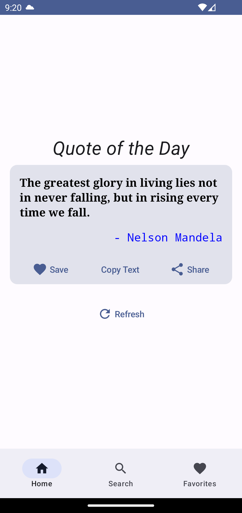
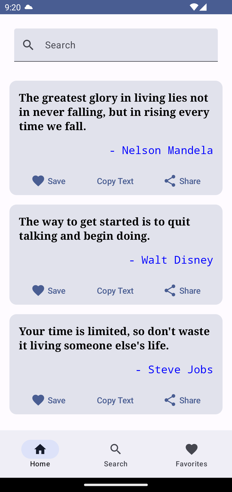
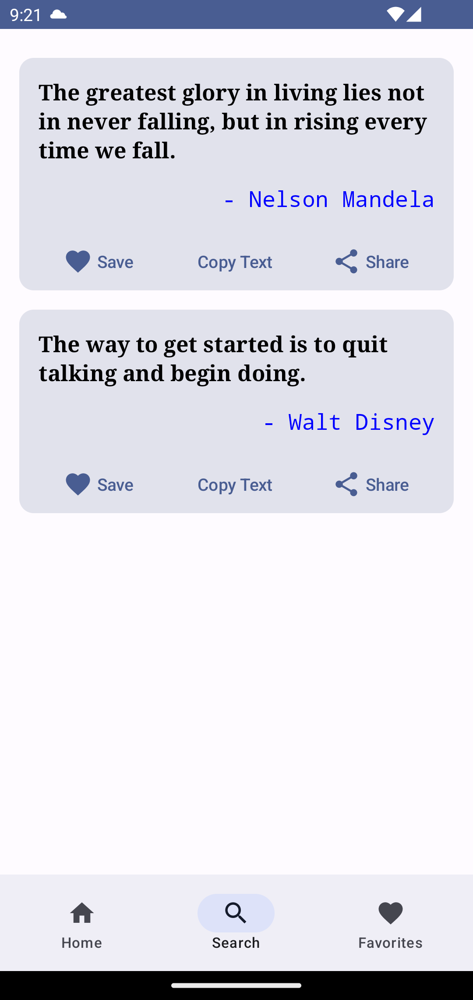

# Quotify App

Quotify app to generate or display inspirational quotes, offering users daily quotes, sharing options, and more.

## Features
Home Screen: Displays a daily inspirational quote.
Search Functionality: Allows users to search for quotes by keywords or authors.
Favorites Screen: Users can save their favorite quotes and access them anytime.
Sharing Options: Users can share quotes with friends and family through various social media platforms.
Random Quote: Provides a random quote feature for users to discover new quotes.
Add/Remove Favorites: Users can add or remove quotes from their favorites list.
System UI Customization: Customizes the system UI colors to match the app's theme.

## Usage
Home Screen: When you open the app, you will be greeted with the Home Screen displaying a daily inspirational quote.
Search Screen: Use the search functionality to find quotes by keywords or authors.
Favorites Screen: Save your favorite quotes and access them anytime from the Favorites Screen.
Sharing: Share quotes with friends and family through various social media platforms.

## Screenshots

   
   
   

## Demo Video

   <video width="320" height="240" controls>
      <source src="./readme/Initial_UI_Recorded.mp4" type="video/mp4">
      Your browser does not support the video tag.
   </video>

## Technology used
Kotlin: Primary programming language for Android development.
Java: Used for some parts of the application.
Gradle: Build automation tool.
Jetpack Compose: Modern toolkit for building native UI.
AndroidX Libraries: Core libraries for Android development.
