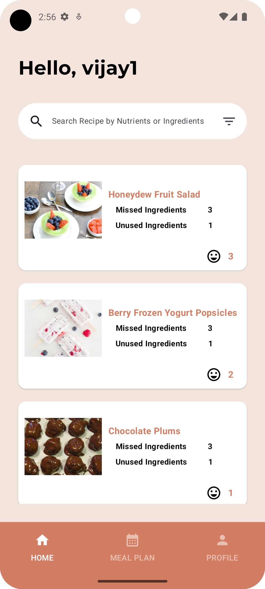

# 7-day-Android-App-Challenge

## Season 1
| Project  | Author                           | Screenshots                      | Tech Stack                |
|----------|--------------------------------|----------------------|---------------------------------------------------------------------------|
| Anime X  | [Abhijith Sreekar](@nasreekar)   |       | - Jetpack Compose + Kotlin - MVVM + Clean Arch (data, domain (usecases) and UI) - Kotlin flows + coroutines - Compose Navigation - Hilt - Retrofit - UI testing |
| Recipe - Meal Mate  | <a href="https://github.com/Siduchels"> Sindhu S </a>, <a href="https://github.com/aliarbaaz"> Mohammed Arbaaz Ali </a>, <a href="https://github.com/ZSank"> Sanket Zade </a> |                         | - <b>Programming Language:</b> Kotlin   - <b>UI Development:</b> Jetpack Compose   - <b>Architecture:</b> MVVM (Model-View-ViewModel)   - <b>Dependency Injection:</b> Hilt   - <b>Networking:</b> Retrofit   - <b>Design Principles:</b> SOLID principles, Design Patterns |
