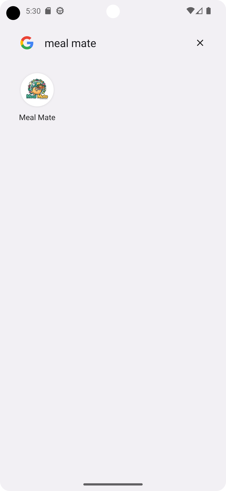
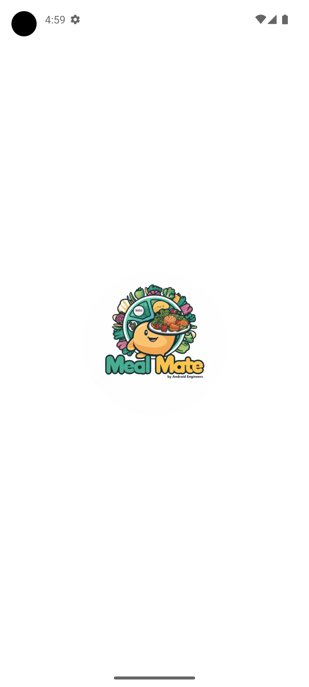

# Recipe Roulette(App Named as Meal Mate)

Meal Mate is a user-friendly mobile app designed to help you discover, organize, and enjoy recipes tailored to your dietary needs and preferences. Whether you're looking for new meal ideas or need to use specific ingredients, Meal Mate simplifies meal planning with smart features.

## Features

- Ingredient-Based Recipe Search: Enter ingredients you have, and Meal Mate suggests recipes you can make.
- Nutrients-Based Recipe Search: Search for recipes based on specific nutrient requirements or health goals (e.g., high-protein, low-carb, rich in vitamins).
- Dietary Restrictions: Specify dietary needs such as vegetarian, gluten-free, or nut-free.
- Recipe Details: View detailed information including ingredients, instructions, cooking time, and nutritional facts.

## Usage

1. Open the App: Launch the Meal Mate app on your device.
2. Search for Recipes:
   - Ingredient-Based: Enter ingredients you have or wish to use.
   - Cuisine Preferences: Select your preferred cuisines.
   - Dietary Restrictions: Choose from dietary options to filter results.
   - Nutrients-Based: Specify nutrient needs or health goals (e.g., increase protein, reduce carbs).
3. View Recipes: Browse the list of suggested recipes, view detailed information, and read user reviews.

## Screenshots

   
   
   
   

## Technology used
* Programming Language: Kotlin
* UI Development: Jetpack Compose
* Architecture: MVVM (Model-View-ViewModel)
* Dependency Injection: Hilt
* Networking: Retrofit
* Design Principles: SOLID principles, Design Patterns

## Credits

### List of contributors:
1. <a href="https://www.linkedin.com/in/sindhu-s-90461321/"> Sindhu S </a>
2. <a href="https://www.linkedin.com/in/mohammedarbaazali/"> Mohammed Arbaaz Ali </a>
3. <a href="https://www.linkedin.com/in/sanketzade/"> Sanket Zade </a>
